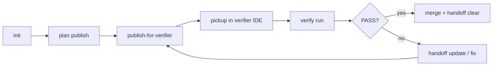

# Multi-agent loop (scaffold → verify → close)

A portable workflow for solo developers using multiple AI agents (Claude Code for
planning, Cursor or Copilot for verification, etc.). All state lives under
`.agent-co-op/` in the consumer repo.

---

## Roles and phases

| Phase | Default role | Agent posture |
|-------|--------------|---------------|
| `plan` | planner | Bootstrap before broad reads; design and decompose |
| `implement` | verifier | Execute handoff; **do not re-plan from scratch** |
| `verify` | verifier | Run checks; report PASS/FAIL only |
| `resume` | resume | Continue listed next steps |

Phase maps to role and work mode automatically (`think` for plan, `background` for
implement/verify/resume). Override per role in `.agent-co-op/<project-id>.json`.

---

## Artifact layout

All paths are relative to the consumer project root.

| Path | Purpose | Git |
|------|---------|-----|
| `.agent-co-op/<project-id>.json` | Project manifest (roles, bootstrap, verification profiles) | Commit |
| `.agent-co-op/handoff-state.json` | Machine-readable handoff state | Ignore |
| `.agent-co-op/CURRENT_HANDOFF.md` | Published pickup contract — paste into any IDE | Ignore |
| `.agent-co-op/handoff.md` | Same content as `CURRENT_HANDOFF.md` (archive copy) | Ignore |
| `.agent-co-op/handoff-history/` | Prior handoff snapshots | Ignore |
| `.agent-co-op/verification-queue.json` | Command queue for verifier | Ignore |
| `.agent-co-op/verification-report.json` | Machine-readable PASS/FAIL results | Ignore |
| `.agent-co-op/verification-report.md` | Human-readable PASS/FAIL table | Ignore |

Run `agent-co-op init <project-id>` once per repo to create the manifest and gitignore
entries.

---

## Full loop



### 0 — Scaffold (once per project)

```bash
agent-co-op init my-app --name "My App"
agent-co-op project validate my-app
```

Add verification commands to the manifest (`verification.profiles.default.commands`).
See `examples/project.example.json`.

Optional: set `bootstrap` and `read_map` on the manifest so published handoffs list
orientation commands and indexed files.

### 1 — Plan (planner agent)

```bash
agent-co-op handoff publish \
  --objective "Design JWT auth" \
  --phase plan \
  --project my-app \
  --context '{"read_map":[{"file":"src/auth.py","lines":"1-40","why":"existing stubs"}]}'
```

**Bootstrap:** In `plan` or `resume`, read `## Bootstrap` in `CURRENT_HANDOFF.md` and
run each listed shell command **before** opening large source files. Bootstrap commands
come from the manifest `bootstrap` field and optional `context.bootstrap` on publish.

Switch IDE → `agent-co-op pickup` (returns `CURRENT_HANDOFF.md`).

### 2 — Hand off to verifier (planner end-of-session)

When implementation is on a feature branch and ready for verification:

```bash
agent-co-op handoff publish-for-verifier \
  --objective "Implement JWT auth" \
  --project my-app \
  --profile default
```

This single command:

1. Builds `.agent-co-op/verification-queue.json` from the manifest profile (includes
   current git branch when available)
2. Publishes `phase=implement` handoff with verifier-oriented default next steps
3. Renders `CURRENT_HANDOFF.md` with Verifier, Bootstrap, and Routing sections

**Planner rule:** Do **not** claim tests or CI passed. That is the verifier's job.

Tell the human the branch name (from handoff git block or `git branch`) and suggest
opening the verifier IDE with `agent-co-op pickup`.

### 3 — Verify (verifier agent)

```bash
agent-co-op handoff status --json    # confirm active, check branch_mismatch_warning
agent-co-op pickup                   # paste into session
agent-co-op verify run               # runs queue; exit 1 on FAIL
agent-co-op verify report --json     # read last summary + paths
```

MCP equivalents: `handoff_status`, `handoff_pickup`, `handoff_run_verification`,
`handoff_verification_report`.

Reports are written to:

- `.agent-co-op/verification-report.md` — PASS/FAIL table
- `.agent-co-op/verification-report.json` — structured results + manual_checks

Reply in chat with a short PASS/FAIL summary; cite report paths instead of pasting full
logs. Review `manual_checks` from the report — they are never auto-executed.

### 4 — Close (after merge)

```bash
agent-co-op handoff clear
```

Clears handoff files **and** verification queue/reports.

Use `handoff history` / `handoff restore` if you need to roll back before clearing.

---

## Core patterns

### Planner must not claim tests passed

- Publish with `handoff publish-for-verifier`, not a manual `--phase implement` claim
- Verifier runs `agent-co-op verify run` and owns the PASS/FAIL outcome

### Bootstrap before large reads

- `plan` / `resume`: run commands under `## Bootstrap` in `CURRENT_HANDOFF.md` first
- Prefer `read_map` line ranges over loading whole files
- See [SessionStart hints](../hooks.md) to nudge agents at session start

### Patch without republish

```bash
agent-co-op handoff update --append-next-steps "Fix failing lint rule"
agent-co-op handoff update --context '{"blockers":["Waiting on API key"]}'
```

### Warnings to heed

`handoff status --json` may include:

| Field | Meaning |
|-------|---------|
| `verification_warning` | `implement` phase with no next_steps and no queue |
| `stale_warning` | Handoff older than 7 days |
| `branch_mismatch_warning` | Current git branch ≠ handoff git branch |

---

## Command cheat sheet

### CLI

| Step | Command |
|------|---------|
| Setup | `agent-co-op init <id>` |
| Plan | `agent-co-op handoff publish --phase plan …` |
| Hand to verifier | `agent-co-op handoff publish-for-verifier …` |
| Resume | `agent-co-op pickup` |
| Status | `agent-co-op handoff status [--json]` |
| Run checks | `agent-co-op verify run [--json]` |
| Read report | `agent-co-op verify report [--json]` |
| Patch | `agent-co-op handoff update …` |
| Close | `agent-co-op handoff clear` |

### MCP tools

| Tool | Purpose |
|------|---------|
| `handoff_publish_for_verifier` | Plan → implement + write queue |
| `handoff_run_verification` | Execute queue; return PASS/FAIL JSON |
| `handoff_verification_report` | Last report paths + summary |
| `handoff_pickup` | Paste-ready `CURRENT_HANDOFF.md` |
| `handoff_status` | Active phase, warnings |
| `handoff_clear` | Clear handoff + verification artifacts |

### MCP read resources (low token)

| URI | Content |
|-----|---------|
| `handoff://current` | `CURRENT_HANDOFF.md` |
| `handoff://status` | Compact status JSON |
| `handoff://queue` | Verification queue |
| `handoff://report` | Latest verification report |

Set `AGENT_CO_OP_ROOT` to the workspace root in MCP server config (see README).

---

## Example manifest verification block

```json
{
  "verification": {
    "profiles": {
      "default": {
        "commands": [
          {"id": "lint", "label": "Ruff", "command": "ruff check src/ tests/"},
          {"id": "test", "label": "Pytest", "command": "pytest -q"}
        ],
        "manual_checks": ["Smoke-test login in browser"]
      }
    }
  }
}
```

---

## Anti-patterns

- Re-planning from scratch when handoff + `git diff` answer what's next
- Bulk-reading docs when `read_map` lists specific line ranges
- Pasting full verification logs into chat
- `handoff clear` before merge unless explicitly requested
- Storing transcript content or secrets in handoff files
